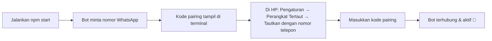

<div align="center">

  # 🍡 MORELA BOT v0.0.1
  ### ⚡ WhatsApp Bot Engine · Owner / Admin / Premium Permission System ⚡

  [](https://nodejs.org/)
  [](https://www.npmjs.com/package/@itsliaaa/baileys)
  [](https://github.com/WiseLibs/better-sqlite3)
  [](LICENSE)
  [](#)

  <p align="center">
    <b>WhatsApp Bot base plain JavaScript (ESM) dengan plugin hot-reload, database SQLite lokal, dan sistem izin berlapis.</b>
    <br />
    <i>99+ command di 9 kategori, mode eval/shell khusus main owner, welcome/goodbye otomatis, dan branded reply.</i>
  </p>

  ---

  [🛠️ Tech Stack](#-tech-stack--teknologi) •
  [✨ Fitur Unggulan](#-fitur-unggulan) •
  [📂 Struktur Project](#-struktur-project) •
  [🚀 Instalasi](#-instalasi--memulai) •
  [📲 Pairing WhatsApp](#-menghubungkan-whatsapp) •
  [🧩 Menulis Plugin](#-menulis-plugin-baru)

</div>

<br />

---

## 🛠️ Tech Stack & Teknologi

<p align="center">
  
  
  
  
  <br />
  
  
  
  
</p>

| Komponen | Teknologi / Library | Deskripsi |
| :--- | :--- | :--- |
| **Bot Engine Core** | `@itsliaaa/baileys` (ESM) | Library WhatsApp Multi-Device Protocol socket handler |
| **Database** | `better-sqlite3` | Penyimpanan lokal: users, groups, group_members, dll. Tanpa server DB eksternal |
| **Media Processing** | `sharp`, `canvas`, `fluent-ffmpeg`, `jimp` | Edit gambar, generate card/thumbnail, konversi audio/video, sticker |
| **OCR & Dokumen** | `tesseract.js`, `pdfkit` | Baca teks dari gambar, generate PDF |
| **Runtime & Process** | `Node.js v18+` | Dijalankan lewat `launcher.js` (supervisor auto-restart) atau langsung `utama.js` |
| **Utility** | `axios`, `cheerio`, `luxon`, `node-cron`, `node-cache` | HTTP client, scraping, waktu, scheduler, cache in-memory |

<br />

---

## 🌟 Fitur Unggulan

<table>
  <tr>
    <td width="50%">
      <h3>🧩 99+ Command / 9 Kategori</h3>
      <p>Plugin modular per folder: <code>owner</code>, <code>admin</code>, <code>tools</code>, <code>sticker</code>, <code>downloader</code>, <code>games</code>, <code>maker</code>, <code>ai</code>, <code>info</code>. Tinggal drop file baru, langsung ke-load.</p>
    </td>
    <td width="50%">
      <h3>🔄 Hot-Reload Plugin</h3>
      <p>File plugin otomatis di-reload saat disimpan (<code>pluginHotReload: true</code>), tanpa perlu restart proses buat perubahan command biasa.</p>
    </td>
  </tr>
  <tr>
    <td width="50%">
      <h3>🛡️ Izin Berlapis</h3>
      <p>Role-based: <b>Main Owner</b>, <b>Owner</b>, <b>Admin Grup</b>, <b>Premium</b>, dan gate registrasi (<code>.daftar</code>) wajib secara default buat semua command.</p>
    </td>
    <td width="50%">
      <h3>♻️ Auto-Restart & Crash Guard</h3>
      <p><code>launcher.js</code> jadi supervisor proses. Auto-restart kalau bot crash, dengan proteksi batas restart cepat biar gak infinite-loop crash.</p>
    </td>
  </tr>
  <tr>
    <td width="50%">
      <h3>🎉 Welcome & Goodbye Otomatis</h3>
      <p>Terpicu dari event <code>group-participants.update</code>: kartu bergambar (foto profil member/bot) + tombol <b>Menu</b> & <b>Daftar</b>/<b>Profil</b>.</p>
    </td>
    <td width="50%">
      <h3>💻 Mode Eval / Shell (Main Owner)</h3>
      <p>Debug live tanpa deploy ulang: eval JS langsung (<code>&gt;kode</code>) atau shell command (<code>$perintah</code>) di server, khusus main owner.</p>
    </td>
  </tr>
</table>

<br />

---

## 📂 Struktur Project

```text
📦 Morela-Bot
 ├── 📄 utama.js                # 🚀 Entry point: socket, auth, reconnect, wiring event
 ├── 📄 launcher.js             # 🔀 Supervisor proses (auto-restart + crash guard)
 ├── 📄 handler.js              # 📩 Router pesan + middleware + pengecekan izin otomatis
 ├── 📄 config.js               # ⚙️ Semua konfigurasi bot (nama, owner, prefix, API key)
 ├── 📁 Core/                   # 🧠 Event bus, store (cache + tulis DB), permission, logging
 ├── 📁 System/                 # 🛡️ Self mode, private mode, cek owner, eval/shell (superowner.js)
 ├── 📁 Library/                # 🛠️ Resolve LID/JID, MessageBuilder, sticker, canvas, util lain
 ├── 📁 Database/                # 💾 SQLite (better-sqlite3): users, groups, group_members
 ├── 📁 Plugins-ESM/            # 🧩 99+ command, per folder kategori
 │   ├── 📁 owner/              # 👑 Owner Control & System Settings
 │   ├── 📁 admin/              # 🛡️ Moderasi grup, welcome/goodbye, antilink
 │   ├── 📁 tools/              # 🔧 Utility umum
 │   ├── 📁 sticker/            # 🖼️ Sticker maker
 │   ├── 📁 downloader/         # 📥 TikTok, YouTube, dst
 │   ├── 📁 games/              # 🎮 Game & RPG
 │   ├── 📁 maker/              # 🎨 Image/text maker
 │   ├── 📁 ai/                 # 🤖 AI chat
 │   └── 📁 info/               # ℹ️ Info & menu
 ├── 📁 data/                   # 💾 File database SQLite + soal game JSON
 ├── 📁 media/                  # 🖼️ Aset gambar (tambahkan sendiri kalau perlu)
 └── 📁 session/                # 🔑 Kredensial login WhatsApp (auto-generate)
```

<br />

---

## 🚀 Instalasi & Memulai

### 1. Prasyarat Sistem
- **Node.js**: `v18.x` atau lebih baru
- **NPM**

### 2. Install Dependencies
```bash
npm install
```

### 3. Konfigurasi
Semua konfigurasi ada langsung di `config.js` (bukan `.env`). Isi nomor owner, prefix, API key, dll di sana sebelum menjalankan bot.

### 4. Jalankan Bot
```bash
# Rekomendasi: pakai launcher.js (auto-restart kalau proses crash)
npm start

# Atau langsung tanpa supervisor
npm run start:direct
```

> Project ini plain JavaScript (bukan TypeScript), tidak ada langkah build/compile. `npm run dev` cuma alias lain untuk `node utama.js`.

<br />

---

## 📲 Menghubungkan WhatsApp



Login pakai **pairing code** (bukan scan QR). Kode ditampilkan langsung di terminal server, bukan lewat dashboard web.

<br />

---

## 🧩 Menulis Plugin Baru

Buat file `.js` di `Plugins-ESM/<kategori>/`:

```js
const handler = async (m, { conn, text, args, isOwner, isAdmin }) => {
  await m.reply('Halo juga!');
};

handler.command = /^(halo|hi)$/i; // wajib, dicocokkan ke command yang diketik
handler.help = ['halo'];
handler.tags = ['tools']; // harus sama dengan nama folder

// Flag akses opsional (default false):
handler.owner = false;
handler.mainOwner = false; // lebih ketat dari owner, cuma owner utama (checkMainOwner)
handler.admin = false;     // command ini cuma buat admin grup
handler.botAdmin = false;
handler.group = false;
handler.private = false;
handler.premium = false;   // butuh akun premium
handler.limit = false;     // true = potong 1 limit harian, atau isi angka buat potong lebih dari 1
handler.cooldown = 2000;   // ms, override cooldown default per-command
handler.ignoreRateLimit = false;
handler.noRegisterGate = false; // true = lolos wajib .daftar (dipakai plugin daftar/register sendiri)

export default handler;
```

Pengecekan akses & pesan penolakan sudah dihandle otomatis oleh `handler.js`, plugin tinggal pasang flag. File otomatis ke-reload saat disave (`pluginHotReload: true`). **Tapi kalau ada perubahan yang gak nyangkut setelah save, restart proses bot manual, jangan cuma andalin hot-reload.**

Plugin juga bisa punya `handler.onText(m, { conn })` untuk menangkap pesan tanpa prefix (return `true` kalau sudah ditangani).

<br />

---

## 🔐 Gate Registrasi (Wajib `.daftar`)

**Semua command butuh registrasi (`.daftar`/`.register`) secara default**, bukan opt-in per plugin. Kalau pengirim belum terdaftar, dia dapat balasan penolakan otomatis dan command-nya gak dijalankan.

Yang **otomatis lolos** dari gate ini (gak perlu `.daftar` dulu):
- Owner bot (`config.owners`)
- Main owner (`checkMainOwner`)
- Admin grup, khusus command yang dipanggil di dalam grup (`checkGroupAdmin`)
- User dengan akun premium (`checkPremiumUser`)
- Plugin yang secara eksplisit ditandai `handler.noRegisterGate = true`, dipakai di `Plugins-ESM/tools/register.js` sendiri, biar user baru tetap bisa jalanin `.daftar`

Pengecekan ini role-based (siapa yang ngirim), bukan berdasarkan flag command (`handler.admin`/`handler.owner` dkk). Jadi admin grup tetap lolos gate walau lagi manggil command biasa yang gak ditandai admin-only.

<br />

---

## 💻 Mode Eval / Shell (Main Owner)

Diimplementasikan di `System/superowner.js`, dipicu otomatis dari isi pesan (bukan command biasa lewat prefix), khusus **main owner**:

| Prefix | Fungsi |
|---|---|
| `>kode` | Eval JS langsung (statement/ekspresi), hasil di-`util.inspect` |
| `=>kode` | Eval JS dibungkus `return`, buat ekspresi singkat |
| `$perintah` | Jalankan shell command langsung di server, tampilkan stdout/stderr |

Berguna buat debug live (cek status API eksternal, isi file di disk, state proses, dll) tanpa perlu deploy ulang. Command yang mengandung pola restart proses (`pm2 restart`, `systemctl restart`, dll) otomatis dikasih jeda & pesan peringatan sebelum dieksekusi.

> ⚠️ Fitur ini setara akses shell penuh ke server. Pastikan `config.owners`/main owner cuma diisi nomor yang beneran dipercaya.

<br />

---

## 📡 Pelacakan Event Grup

`Core/store.js` otomatis nulis ke database setiap ada perubahan di grup:
- Member join/keluar/promote/demote → tabel `group_members` (`Database/groupMembers.js`)
- Kalau bot sendiri yang dikick/keluar/dipromote/didemote → status `botInGroup`/`isBotAdmin` tersimpan di tabel `groups`
- Kalau member (bukan bot) join/keluar dan fitur welcome/goodbye grup itu aktif → otomatis kirim pesan welcome/goodbye

<br />

---

## 🎉 Fitur Welcome & Goodbye

Diimplementasikan di `Plugins-ESM/admin/welcome.js` dan `Plugins-ESM/admin/goodbye.js`, dipicu otomatis dari event `group-participants.update` di `Core/store.js`. Tampilan pakai `ButtonV2` (card + thumbnail + 2 tombol).

- Gambar thumbnail: coba ambil foto profil member yang join/keluar dulu; kalau kosong/private/gagal, otomatis fallback pakai foto profil bot sendiri.
- Tombol welcome: **Menu** (`.menu`) dan **Daftar** (`.daftar`).
- Tombol goodbye: **Menu** (`.menu`) dan **Profil** (`.profil <nomor>`).
- Status disimpan per-grup di kolom `settings` tabel `groups` (`settings.welcome` / `settings.goodbye`, lewat `upsertGroupSettings`).

| Command | Kegunaan |
|---|---|
| `.welcome on` / `.welcome off` | Aktif/nonaktifkan welcome otomatis di grup ini |
| `.welcome` / `.welcome status` | Cek status welcome |
| `.welcome @user` / `.teswelcome @user` | Kirim contoh pesan welcome manual (buat testing) |
| `.goodbye on` / `.goodbye off` | Aktif/nonaktifkan goodbye otomatis di grup ini |
| `.goodbye` / `.goodbye status` | Cek status goodbye |
| `.goodbye @user` / `.tesgoodbye @user` | Kirim contoh pesan goodbye manual (buat testing) |

Semua command di atas khusus admin grup (`handler.admin = true`, `handler.group = true`).

<br />

---

## 🎨 Tampilan Balasan (Branded Replies)

Balasan teks otomatis dibungkus tampilan "forwarded dari channel" lewat `Core/sockext.js`. Atur lewat `config.js`: `ownerName`, `channelJid`, `channelName`, `thumbnail`. Matikan dengan `brandedReplies: false`.

<br />

---

## ⚙️ Konfigurasi Tambahan

- **`media/menu.jpg`**: belum disertakan, tambahkan sendiri kalau mau menu bergambar.
- **`githubToken` / `githubRepo`**: dipakai untuk push/backup plugin langsung ke GitHub lewat REST API (bukan `git push` biasa).

> Semua nilai sensitif (nomor owner, API key, token) ada langsung di `config.js`. Kalau mau push ke repo publik, kosongkan dulu atau masukkan `config.js` ke `.gitignore`.

<br />

---

## 📜 Lisensi

MIT

<div align="center">
  <sub>Built with 🍡 by <a href="https://github.com/Morelaa">Morelaa</a></sub>
</div>
