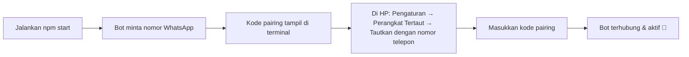

<div align="center">

  # 🍡 MORELA BOT
  ### ⚡ WhatsApp Bot Engine · AI Agent · Multi-Style UI · Owner/Admin/Premium Permission System ⚡

  [](https://nodejs.org/)
  [](https://www.npmjs.com/package/@itsliaaa/baileys)
  [](https://github.com/WiseLibs/better-sqlite3)
  [](#-messagebuilder-v46--engine-tampilan-pesan)
  [](LICENSE)
  [](#)

  <p align="center">
    <b>WhatsApp Bot base plain JavaScript (ESM) dengan plugin hot-reload, database SQLite lokal, sistem izin berlapis, dan AI Agent yang bisa nulis pluginnya sendiri.</b>
    <br />
    <i>104 command aktif di 9 kategori, engine tampilan pesan custom (MessageBuilder v4.6), 4 gaya menu + 5 gaya reply + 2 gaya owner card, mode eval/shell khusus main owner.</i>
  </p>

  ---

  [🛠️ Tech Stack](#-tech-stack--teknologi) •
  [✨ Fitur Unggulan](#-fitur-unggulan) •
  [🎨 MessageBuilder](#-messagebuilder-v46--engine-tampilan-pesan) •
  [🖼️ Gaya Tampilan](#️-gaya-tampilan-menu--owner--reply) •
  [📂 Struktur Project](#-struktur-project) •
  [🚀 Instalasi](#-instalasi--memulai) •
  [📲 Pairing WhatsApp](#-menghubungkan-whatsapp) •
  [🧩 Menulis Plugin](#-menulis-plugin-baru) •
  [🕒 Sewa Bot](#-sewa-bot-owner--sewabotjs--delsewajs)

</div>

<br />

---

## 🛠️ Tech Stack & Teknologi

<p align="center">
  
  
  
  
  <br />
  
  
  
  
  
</p>

| Komponen | Teknologi / Library | Deskripsi |
| :--- | :--- | :--- |
| **Bot Engine Core** | `@itsliaaa/baileys` (ESM) | Library WhatsApp Multi-Device Protocol socket handler |
| **Database** | `better-sqlite3` | Penyimpanan lokal: `users`, `groups`, `group_members`, `lid_map`, `stats`, `usage_limit`, `chat_count`, `kv_store` |
| **Media Processing** | `sharp`, `canvas`, `fluent-ffmpeg`, `jimp` | Edit gambar, generate card/thumbnail, konversi audio/video, sticker |
| **AI Agent** | `axios` ke **OpenRouter** (model gratis, fallback berantai) | Chat + tool-calling untuk `Plugins-ESM/ai/aiagent.js` |
| **AI Image** | `axios` ke **Hugging Face Space** (Qwen Image Edit LoRA, Kroma Krea2) | `aiedit.js` (edit foto) & `nanobanana.js` (generate foto) |
| **OCR & Dokumen** | `tesseract.js`, `pdfkit` | Baca teks dari gambar, generate PDF |
| **Runtime & Process** | `Node.js v18+` | Dijalankan lewat `launcher.js` (supervisor auto-restart) atau langsung `utama.js` |
| **Utility** | `axios`, `cheerio`, `luxon`, `node-cron`, `node-cache`, `archiver`, `yt-search` | HTTP client, scraping, waktu, scheduler, cache in-memory, zip backup, pencarian YouTube |

<br />

---

## 🌟 Fitur Unggulan

<table>
  <tr>
    <td width="50%">
      <h3>🤖 AI Agent Self-Coding</h3>
      <p><code>Plugins-ESM/ai/aiagent.js</code> - dipicu wake word <b>"morela"</b> (bukan command biasa), khusus <b>main owner</b>. Bisa <i>tool-calling</i>: nulis plugin baru (<code>write_plugin</code>), edit file (<code>edit_file</code>), baca log & analisis error (<code>check_logs</code>, <code>analyze_error</code>), cari/lihat plugin (<code>find_plugin</code>, <code>get_plugin</code>), backup project (<code>run_backup</code>), sampai download video/musik & edit gambar langsung dari chat. Model dari OpenRouter dengan daftar fallback berantai kalau satu model kena rate-limit.</p>
    </td>
    <td width="50%">
      <h3>🎨 AI Image: Edit & Generate</h3>
      <p><code>aiedit.js</code> (khusus premium) edit foto pakai model Qwen Image Edit LoRA lewat Hugging Face Space - reply foto + prompt. <code>nanobanana.js</code> generate gambar baru dari teks pakai model Kroma Krea2 LoRA. Keduanya pakai sistem token Hugging Face yang bisa multi-akun (auto-rotate kalau kena limit).</p>
    </td>
  </tr>
  <tr>
    <td width="50%">
      <h3>🖌️ Multi-Style UI System</h3>
      <p>3 command khusus owner buat ganti "kulit" tampilan bot tanpa sentuh kode: <code>.setmenu</code> (4 gaya), <code>.setreplystyle</code> (5 gaya), <code>.setownerstyle</code> (2 gaya). Semua dipilih lewat tombol <i>single_select</i> interaktif, bukan cuma ketik manual.</p>
    </td>
    <td width="50%">
      <h3>🕒 Sewa Bot Otomatis</h3>
      <p><code>.sewabot</code> / <code>.delsewa</code> - atur masa sewa bot per grup lewat pemilihan grup via tombol interaktif, lalu ketik tanggal jatuh tempo. Scheduler background otomatis ngingetin owner H-3 sebelum habis dan bikin bot keluar sendiri kalau gak diperpanjang. Khusus owner.</p>
    </td>
  </tr>
  <tr>
    <td width="50%">
      <h3>🧩 104 Command / 9 Kategori</h3>
      <p>Plugin modular per folder: <code>owner</code> (23), <code>admin</code> (18), <code>tools</code> (21), <code>sticker</code> (13), <code>downloader</code> (8), <code>games</code> (9), <code>maker</code> (4), <code>ai</code> (3), <code>info</code> (5). Tinggal drop file baru, langsung ke-load.</p>
    </td>
    <td width="50%">
      <h3>🔄 Hot-Reload Plugin</h3>
      <p>File plugin otomatis di-reload saat disimpan (<code>pluginHotReload: true</code>), tanpa perlu restart proses buat perubahan command biasa.</p>
    </td>
  </tr>
  <tr>
    <td width="50%">
      <h3>🛡️ Izin Berlapis + Suite Anti-Spam</h3>
      <p>Role-based: <b>Main Owner</b>, <b>Owner</b>, <b>Admin Grup</b>, <b>Premium</b>, gate registrasi (<code>.daftar</code>) wajib default. Plus suite moderasi grup: <code>antilink</code>, <code>antivirtex</code>, <code>antijoki</code>, <code>antiswgc</code>, <code>anticatalog</code>/<code>antibug</code>, <code>ban/unban</code>.</p>
    </td>
    <td width="50%">
      <h3>♻️ Auto-Restart & Crash Guard</h3>
      <p><code>launcher.js</code> jadi supervisor proses. Auto-restart kalau bot crash, dengan proteksi batas restart cepat biar gak infinite-loop crash.</p>
    </td>
  </tr>
  <tr>
    <td width="50%">
      <h3>🎉 Welcome & Goodbye Otomatis</h3>
      <p>Terpicu dari event <code>group-participants.update</code>: kartu bergambar (<code>ButtonV2</code>, foto profil member/bot) + tombol <b>Menu</b> & <b>Daftar</b>/<b>Profil</b>.</p>
    </td>
    <td width="50%">
      <h3>💻 Mode Eval / Shell (Main Owner)</h3>
      <p>Debug live tanpa deploy ulang: eval JS langsung (<code>&gt;kode</code>) atau shell command (<code>$perintah</code>) di server, khusus main owner.</p>
    </td>
  </tr>
</table>

<br />

---

## 🎨 MessageBuilder (v4.6) - Engine Tampilan Pesan

`Library/MessageBuilder.js` adalah engine internal buat merakit semua jenis pesan interaktif WhatsApp (native flow, button, card, sampai gaya "AI rich response"). Dipakai hampir semua plugin: `setmenu`, `setreplystyle`, `welcome`, `goodbye`, `aiagent`, `sewabot`, dll. Isinya 5 class:

| Class | Fungsi | Fitur Utama |
|---|---|---|
| **`Toolkit`** | Kumpulan static utility, dipakai internal semua class lain | `resize()` (resize gambar via sharp), `fetchBuffer()`, `resolveMedia()` (normalisasi input url/buffer/base64 → url upload WA), `replyRaw()` (kirim reply manual dengan quote persis dari pesan asli), `getMp4Duration()` & `getMp4Preview()` (baca durasi & screenshot frame video pakai ffmpeg tanpa file temp), `extractIE()` (parser sintaks `[teks](url)` / `[](url)` jadi *inline entity* hyperlink/citation/latex) |
| **`BaseBuilder`** | Parent class abstrak, diwarisi 4 builder di bawah | `setTitle()`, `setSubtitle()`, `setBody()`, `setFooter()`, `setContextInfo()`, `addPayload()` - semua *chainable* (return `this`) |
| **`Button`** (v1) | Native flow message generasi baru: single_select dengan section/row, quick reply, url, call, copy, location, address, reminder | `addSelection()` + `makeSection()` + `makeRow()` buat list bertingkat, `addUrl()`, `addCopy()`, `addCall()`, `addReply()`, `setImage()`/`setVideo()`/`setDocument()` untuk header media, `send()` langsung relay ke WA |
| **`ButtonV2`** | Gaya button klasik (`buttonsMessage`), lebih ringan, dipakai di welcome/goodbye | `addButton()` (quick button teks), `addRawButton()` (custom object), `setThumbnail()` (auto resize 300x300), `setMedia()` untuk header custom |
| **`Carousel`** | Rangkaian card geser (tiap card wajib ada media header) | `addCard()` (terima 1 card atau array), otomatis validasi tiap card punya `hasMediaAttachment`, hasil pesan di-cache ke `kv_store` buat dipakai ulang |
| **`AIRich`** | Bikin balasan gaya "AI rich response" (bubble forwarded dari bot AI, mirip Meta AI) | `addText()` (markdown + hyperlink/citation/latex), `addCode()` (syntax highlighter built-in untuk JS/TS/Python/Java/Go/C/C++/PHP/Rust/HTML/Bash/Markdown), `addTable()`, `addImage()`, `addVideo()`, `addProduct()`, `addPost()`, `addReels()`, `addSource()`, `addTip()`, `addSuggest()` (tombol saran lanjutan) - tiap section bisa layout `Single`/`HScroll`/`ActionRow` |

<br />

---

## 🖼️ Gaya Tampilan: Menu / Owner / Reply

Semua diatur lewat command interaktif (tombol *single_select*), tersimpan permanen via `System/*style.js`.

### `.setmenu` - 4 Gaya Menu
| Gaya | Nama | Tampilan |
|---|---|---|
| **v1** | Menu Gambar + Aksi | Menu bergambar dengan tombol kategori, beli, telepon, dan owner |
| **v2** | Menu Foto Profil | Menu dengan foto profil pengirim dan daftar tombol kategori |
| **v3** | Menu Interaktif | Menu bergambar dengan tombol kategori dan tombol donasi |
| **v4** | Menu Card + Badge | Menu bergambar dengan badge card serta tombol menu dan info |

### `.setreplystyle` - 5 Gaya Balasan
| Gaya | Nama | Tampilan |
|---|---|---|
| **v1** | Link Preview Card | Balasan tampil sebagai link preview kosong dengan kutipan kontak bot |
| **v2** | Native Flow | Balasan interaktif tanpa gambar dengan kutipan undangan grup |
| **v3** | Quoted Order Card | Balasan interaktif dengan kutipan card produk bergambar |
| **v4** | Order Card Besar | Balasan berupa card produk besar bergambar dengan badge kecil |
| **v5** | Link Card + Order | Gabungan V1 & V3: link preview kosong dengan kutipan card produk bergambar |

### `.setownerstyle` - 2 Gaya Kartu Owner
| Gaya | Nama | Tampilan |
|---|---|---|
| **v1** | Contact Card | Gaya kartu kontak (vCard) simpel |
| **v2** | Interactive Booking Card | Gaya kartu profil dengan tombol/native flow |

<br />

---

## 📂 Struktur Project

```text
📦 Morela-Bot
 ├── 📄 utama.js                # 🚀 Entry point: socket, auth, reconnect, wiring event
 ├── 📄 launcher.js             # 🔀 Supervisor proses (auto-restart + crash guard)
 ├── 📄 handler.js              # 📩 Router pesan + middleware + pengecekan izin otomatis
 ├── 📄 config.js               # ⚙️ Semua konfigurasi bot (nama, owner, prefix, API key)
 ├── 📁 Core/                   # 🧠 Event bus, store (cache + tulis DB), permission, logging, branded reply
 ├── 📁 System/                 # 🛡️ Self mode, private mode, cek owner, eval/shell, menu/owner/reply style
 ├── 📁 Library/                # 🛠️ Resolve LID/JID, MessageBuilder v4.6, sticker, canvas, download helper
 ├── 📁 Database/                # 💾 SQLite (better-sqlite3): users, groups, group_members, stats, usage_limit, chat_count, kv_store
 ├── 📁 Plugins-ESM/            # 🧩 104 command, per folder kategori
 │   ├── 📁 owner/              # 👑 23 command - kontrol bot & sistem (termasuk style & sewa bot)
 │   ├── 📁 admin/              # 🛡️ 18 command - moderasi grup, welcome/goodbye, anti-spam
 │   ├── 📁 tools/              # 🔧 21 command - utility umum & registrasi
 │   ├── 📁 sticker/            # 🖼️ 13 command - sticker maker (termasuk brat & AI)
 │   ├── 📁 downloader/         # 📥 8 command - TikTok, YouTube, IG, FB, Mediafire
 │   ├── 📁 games/              # 🎮 9 command - mini-game grup
 │   ├── 📁 maker/              # 🎨 4 command - image/text maker
 │   ├── 📁 ai/                 # 🤖 3 command - AI agent, edit gambar, generate gambar
 │   └── 📁 info/               # ℹ️ 5 command - info & menu
 ├── 📁 data/                   # 💾 File database SQLite + soal game JSON
 ├── 📁 media/                  # 🖼️ Aset gambar (register.jpg, brat assets, dll)
 └── 📁 session/                # 🔑 Kredensial login WhatsApp (auto-generate)
```

<br />

---

## 🚀 Instalasi & Memulai

### 1. Prasyarat Sistem
- **Node.js**: `v18.x` atau lebih baru
- **NPM**

### 2. Install Dependencies
```bash
npm install
```

### 3. Konfigurasi
Semua konfigurasi ada langsung di `config.js` (bukan `.env`). Isi nomor owner, prefix, API key (OpenRouter untuk AI agent, Hugging Face untuk AI image), dll di sana sebelum menjalankan bot.

### 4. Jalankan Bot
```bash
# Rekomendasi: pakai launcher.js (auto-restart kalau proses crash)
npm start

# Atau langsung tanpa supervisor
npm run start:direct
```

> Project ini plain JavaScript (bukan TypeScript), tidak ada langkah build/compile. `npm run dev` cuma alias lain untuk `node utama.js`.

<br />

---

## 📲 Menghubungkan WhatsApp



Login pakai **pairing code** (bukan scan QR). Kode ditampilkan langsung di terminal server, bukan lewat dashboard web.

<br />

---

## 🧩 Menulis Plugin Baru

Buat file `.js` di `Plugins-ESM/<kategori>/`:

```js
const handler = async (m, { conn, text, args, isOwner, isAdmin }) => {
  await m.reply('Halo juga!');
};

handler.command = /^(halo|hi)$/i; // wajib, dicocokkan ke command yang diketik
handler.help = ['halo'];
handler.tags = ['tools']; // harus sama dengan nama folder

// Flag akses opsional (default false):
handler.owner = false;
handler.mainOwner = false; // lebih ketat dari owner, cuma owner utama (checkMainOwner)
handler.admin = false;     // command ini cuma buat admin grup
handler.botAdmin = false;
handler.group = false;
handler.private = false;
handler.premium = false;   // butuh akun premium
handler.limit = false;     // true = potong 1 limit harian, atau isi angka buat potong lebih dari 1
handler.cooldown = 2000;   // ms, override cooldown default per-command
handler.ignoreRateLimit = false;
handler.noRegisterGate = false; // true = lolos wajib .daftar (dipakai plugin daftar/register sendiri)

export default handler;
```

Pengecekan akses & pesan penolakan sudah dihandle otomatis oleh `handler.js`, plugin tinggal pasang flag. File otomatis ke-reload saat disave (`pluginHotReload: true`). **Tapi kalau ada perubahan yang gak nyangkut setelah save, restart proses bot manual, jangan cuma andalin hot-reload.**

Plugin juga bisa punya `handler.onText(m, { conn })` untuk menangkap pesan tanpa prefix (return `true` kalau sudah ditangani) - ini yang dipakai `aiagent.js` buat nangkep wake word "morela".

> 💡 Tips: plugin `aiagent.js` (khusus main owner, panggil dengan kata "morela") bisa disuruh langsung nulis plugin baru buat kamu lewat tool `write_plugin` - tinggal chat "morela buatin command ..." dan bot bakal generate + simpan file plugin-nya sendiri.

<br />

---

## 🕒 Sewa Bot (Owner) - `sewabot.js` & `delsewa.js`

Fitur buat owner yang nyewain bot ke grup orang lain dengan masa aktif terbatas. Ada 3 bagian: 2 plugin command dan 1 scheduler background (`Core/sewaScheduler.js`).

**Alur pakai `.sewabot`:**
1. Ketik `.sewabot` tanpa argumen → bot nampilin daftar semua grup tempat dia jadi member lewat tombol *single_select* (nama grup, jumlah member, JID).
2. Ketuk salah satu grup → bot balik nanya tanggal jatuh tempo sewa (nunggu balasan teks di chat yang sama, sesi timeout 5 menit, cuma nerima balasan dari pengirim yang sama).
3. Ketik tanggal, format bebas: `15 september 2026` atau `15-09-2026` (nama bulan Indonesia didukung, singkatan juga bisa: `jan`, `feb`, `agu`/`ags`, dst). Ketik `batal` buat batalin proses.
4. Bot simpan status sewa ke kolom `settings.sewa` grup itu di database: `active`, `tenantJid`, `startedAt`, `untilAt`, `reminded`.

**Alur pakai `.delsewa`:** sama seperti `.sewabot` tapi nampilin daftar grup yang **lagi disewa** (dengan tanggal habisnya), diketuk salah satu → status sewa grup itu langsung dihapus (`sewa: null`), reminder & auto-keluar otomatis nonaktif buat grup tersebut.

**`Core/sewaScheduler.js`** jalan otomatis tiap 15 menit ngecek semua grup yang punya status sewa aktif:
- **H-3 sebelum habis** → kirim reminder ke grup + tag owner, biar diperpanjang.
- **Udah lewat tanggal habis** → kirim pesan pemberitahuan ke grup, bot otomatis `groupLeave()` dari grup itu, lalu data grupnya dihapus dari database.

| Command | Fungsi | Akses |
|---|---|---|
| `.sewabot` | Pilih grup lalu set tanggal jatuh tempo sewa bot | Owner |
| `.sewabot <jid@g.us>` | Langsung ke step input tanggal buat grup tertentu (skip pilih dari daftar) | Owner |
| `.delsewa` | Pilih grup yang lagi disewa buat dihapus status sewanya | Owner |
| `.delsewa <jid@g.us>` | Langsung hapus status sewa grup tertentu | Owner |

<br />

---

## 🔐 Gate Registrasi (Wajib `.daftar`)

**Semua command butuh registrasi (`.daftar`/`.register`) secara default**, bukan opt-in per plugin. Kalau pengirim belum terdaftar, dia dapat balasan penolakan otomatis dan command-nya gak dijalankan.

Yang **otomatis lolos** dari gate ini (gak perlu `.daftar` dulu):
- Owner bot (`config.owners`)
- Main owner (`checkMainOwner`)
- Admin grup, khusus command yang dipanggil di dalam grup (`checkGroupAdmin`)
- User dengan akun premium (`checkPremiumUser`)
- Plugin yang secara eksplisit ditandai `handler.noRegisterGate = true`, dipakai di `Plugins-ESM/tools/register.js` sendiri, biar user baru tetap bisa jalanin `.daftar`

Pengecekan ini role-based (siapa yang ngirim), bukan berdasarkan flag command (`handler.admin`/`handler.owner` dkk). Jadi admin grup tetap lolos gate walau lagi manggil command biasa yang gak ditandai admin-only.

<br />

---

## 💻 Mode Eval / Shell (Main Owner)

Diimplementasikan di `System/superowner.js`, dipicu otomatis dari isi pesan (bukan command biasa lewat prefix), khusus **main owner**:

| Prefix | Fungsi |
|---|---|
| `>kode` | Eval JS langsung (statement/ekspresi), hasil di-`util.inspect` |
| `=>kode` | Eval JS dibungkus `return`, buat ekspresi singkat |
| `$perintah` | Jalankan shell command langsung di server, tampilkan stdout/stderr |

Berguna buat debug live (cek status API eksternal, isi file di disk, state proses, dll) tanpa perlu deploy ulang. Command yang mengandung pola restart proses (`pm2 restart`, `systemctl restart`, dll) otomatis dikasih jeda & pesan peringatan sebelum dieksekusi.

> ⚠️ Fitur ini setara akses shell penuh ke server. Pastikan `config.owners`/main owner cuma diisi nomor yang beneran dipercaya.

<br />

---

## 🤖 AI Agent (Main Owner) - `aiagent.js`

Dipicu **wake word "morela"** di dalam kalimat (bukan prefix command), khusus **main owner**, dengan history percakapan per-chat (auto-expire 6 jam / max 200 sesi).

**Tools yang bisa dipanggil AI secara otonom:**

| Tool | Fungsi |
|---|---|
| `download_video` / `search_video` / `download_music` | Cari & download video/musik YouTube langsung dari chat |
| `edit_image` | Edit gambar yang direply (deteksi otomatis dari kata "edit/ubah/hapus/tambah" + ada foto) |
| `list_files` / `read_file` | Lihat isi struktur project & baca isi file plugin |
| `write_plugin` | **Generate & simpan plugin baru** langsung ke `Plugins-ESM/` dari instruksi bahasa natural |
| `edit_file` | Edit file plugin yang sudah ada |
| `scan_and_count` | Hitung ulang jumlah plugin/command di project |
| `check_logs` / `analyze_error` | Baca log runtime & bantu diagnosa error |
| `find_plugin` / `get_plugin` | Cari command & lihat isi kodenya |
| `run_backup` | Trigger backup project (sama seperti `.backup`) |

Model AI diambil dari daftar model gratis OpenRouter dengan **fallback berantai** (kalau model 1 kena limit, otomatis lanjut ke model berikutnya). Command `.reset`/`.lupa`/`.forget`/`.clear` buat menghapus history percakapan AI.

<br />

---

## 📡 Pelacakan Event Grup

`Core/store.js` otomatis nulis ke database setiap ada perubahan di grup:
- Member join/keluar/promote/demote → tabel `group_members` (`Database/groupMembers.js`)
- Kalau bot sendiri yang dikick/keluar/dipromote/didemote → status `botInGroup`/`isBotAdmin` tersimpan di tabel `groups`
- Kalau member (bukan bot) join/keluar dan fitur welcome/goodbye grup itu aktif → otomatis kirim pesan welcome/goodbye

<br />

---

## 🎉 Fitur Welcome & Goodbye

Diimplementasikan di `Plugins-ESM/admin/welcome.js` dan `Plugins-ESM/admin/goodbye.js`, dipicu otomatis dari event `group-participants.update` di `Core/store.js`. Tampilan pakai `ButtonV2` (card + thumbnail + 2 tombol).

- Gambar thumbnail: coba ambil foto profil member yang join/keluar dulu; kalau kosong/private/gagal, otomatis fallback pakai foto profil bot sendiri.
- Tombol welcome: **Menu** (`.menu`) dan **Daftar** (`.daftar`).
- Tombol goodbye: **Menu** (`.menu`) dan **Profil** (`.profil <nomor>`).
- Status disimpan per-grup di kolom `settings` tabel `groups` (`settings.welcome` / `settings.goodbye`, lewat `upsertGroupSettings`).

| Command | Kegunaan |
|---|---|
| `.welcome on` / `.welcome off` | Aktif/nonaktifkan welcome otomatis di grup ini |
| `.welcome` / `.welcome status` | Cek status welcome |
| `.welcome @user` / `.teswelcome @user` | Kirim contoh pesan welcome manual (buat testing) |
| `.goodbye on` / `.goodbye off` | Aktif/nonaktifkan goodbye otomatis di grup ini |
| `.goodbye` / `.goodbye status` | Cek status goodbye |
| `.goodbye @user` / `.tesgoodbye @user` | Kirim contoh pesan goodbye manual (buat testing) |

Semua command di atas khusus admin grup (`handler.admin = true`, `handler.group = true`).

<br />

---

## 🎨 Tampilan Balasan (Branded Replies)

Balasan teks otomatis dibungkus tampilan "forwarded dari channel" lewat `Core/sockext.js`. Atur lewat `config.js`: `ownerName`, `channelJid`, `channelName`, `thumbnail`. Matikan dengan `brandedReplies: false`. Gaya visual balasan bisa dikustomisasi lebih jauh lewat `.setreplystyle` (lihat [Gaya Tampilan](#️-gaya-tampilan-menu--owner--reply)).

<br />

---

## ⚙️ Konfigurasi Tambahan

- **`media/menu.jpg`**: dipakai sebagai gambar header menu/style-picker; ganti sendiri kalau mau tampilan custom.
- **`githubToken` / `githubRepo`**: dipakai untuk push/backup plugin langsung ke GitHub lewat REST API (bukan `git push` biasa), lewat command `.pushgit`.
- **`apiKeys.openrouter`**: wajib diisi buat fitur AI Agent (`aiagent.js`).
- **`apiKeys.huggingface`**: wajib diisi (bisa array multi-token buat auto-rotate) buat fitur `aiedit` & `nanobanana`.

> Semua nilai sensitif (nomor owner, API key, token) ada langsung di `config.js`. Kalau mau push ke repo publik, kosongkan dulu atau masukkan `config.js` ke `.gitignore`.

<br />

---

## 📜 Lisensi

MIT

<div align="center">
  <sub>Built with 🍡 by <a href="https://github.com/Morelaa">Morelaa</a></sub>
</div>
